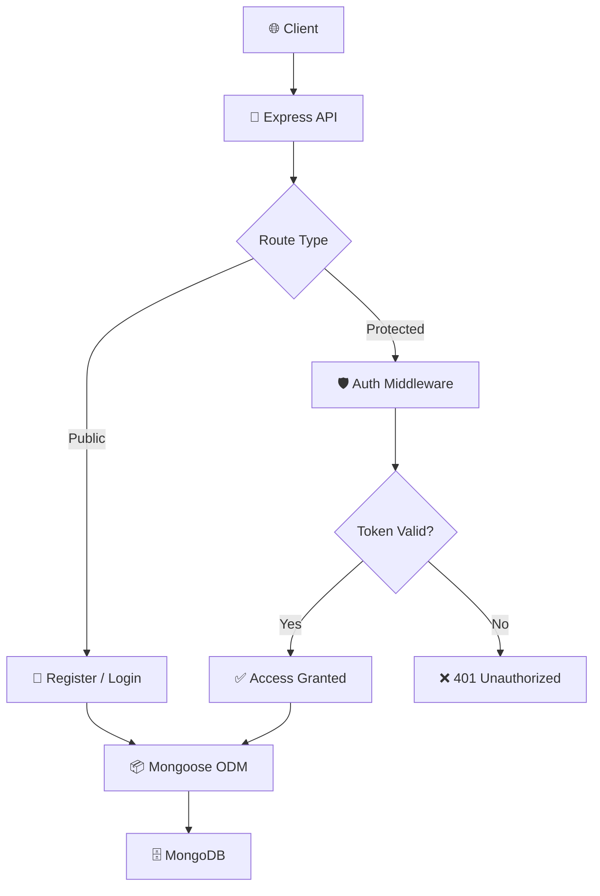

<div align="center">

# 🔑 Authentication System

**A secure backend implementing registration, login, JWT authentication, and protected routes**


</div>

---

## 📑 Table of Contents

- [Overview](#-overview)
- [Features](#-features)
- [Tech Stack](#-tech-stack)
- [Architecture](#-architecture)
- [API Endpoints](#-api-endpoints)
- [Getting Started](#-getting-started)
- [Learning Outcomes](#-learning-outcomes)
- [Future Improvements](#-future-improvements)
- [Author](#-author)

---

## 📖 Overview

**Authentication System** is a secure backend application that provides user registration, login, password encryption, JWT-based authentication, and protected routes.

The project demonstrates modern authentication and authorization techniques commonly used in production web applications — from password hashing with bcryptjs to stateless session management with JSON Web Tokens.

---

## ✨ Features

| Feature | Description |
|---|---|
| 📝 User Registration | Create a new account with hashed password storage |
| 🔐 User Login | Authenticate and receive a signed JWT |
| 🔒 Password Hashing | Passwords encrypted with bcryptjs before storage |
| 🎫 JWT Authentication | Stateless token-based session management |
| 🛡️ Protected Routes | Middleware guards routes from unauthenticated access |
| ⚙️ Middleware-Based Security | Clean, reusable auth middleware across routes |

---

## 🛠 Tech Stack

| Layer | Technologies |
|---|---|
| **Backend** | Node.js, Express.js |
| **Database** | MongoDB, Mongoose |
| **Security** | JWT, bcryptjs |

---

## 🏗 Architecture



---

## 📡 API Endpoints

| Method | Endpoint | Access | Description |
|---|---|---|---|
| `POST` | `/api/auth/register` | Public | Register a new user |
| `POST` | `/api/auth/login` | Public | Login and receive JWT |
| `GET` | `/api/auth/profile` | Protected | Fetch authenticated user's profile |

```js
// POST register
router.post('/api/auth/register', async (req, res) => {
  const hashed = await bcrypt.hash(req.body.password, 10);
  const user = new User({ ...req.body, password: hashed });
  await user.save();
  res.status(201).json({ message: 'User registered' });
});

// POST login
router.post('/api/auth/login', async (req, res) => {
  const user = await User.findOne({ email: req.body.email });
  const valid = await bcrypt.compare(req.body.password, user.password);
  if (!valid) return res.status(401).json({ message: 'Invalid credentials' });
  const token = jwt.sign({ id: user._id }, process.env.JWT_SECRET, { expiresIn: '7d' });
  res.json({ token });
});

// Auth middleware
const protect = (req, res, next) => {
  const token = req.headers.authorization?.split(' ')[1];
  if (!token) return res.status(401).json({ message: 'Unauthorized' });
  jwt.verify(token, process.env.JWT_SECRET, (err, decoded) => {
    if (err) return res.status(401).json({ message: 'Invalid token' });
    req.user = decoded;
    next();
  });
};
```

---

## 🚀 Getting Started

### Prerequisites
- Node.js (v16+)
- MongoDB (local or Atlas)

### Installation

```bash
# Clone the repository
git clone https://github.com/Jeevan9898/auth-system.git
cd auth-system

# Install dependencies
npm install

# Set up environment variables
cp .env.example .env
# Add MONGO_URI, JWT_SECRET, and PORT to .env

# Start the server
npm run dev
```

### Environment Variables

```env
MONGO_URI=your_mongodb_connection_string
JWT_SECRET=your_super_secret_key
PORT=5000
```

---

## 🎓 Learning Outcomes

- Authentication Systems
- Authorization
- JWT Implementation
- Password Encryption
- Middleware Development

---

## 🔮 Future Improvements

- [ ] Password Reset
- [ ] Email Verification
- [ ] OAuth Integration
- [ ] Role-Based Access Control

---

## 👤 Author

**Jeevan Yadav**

[](https://jeevan-yadav.vercel.app/)
[](https://github.com/Jeevan9898)
